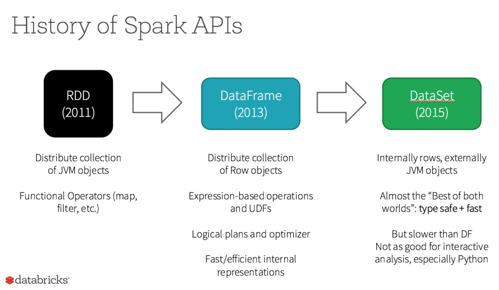

# Terms


RDD: Resilient Distributed Dataset [Datastack - RDD SPark](https://databricks.com/glossary/what-is-rdd)
RDD was the primary user-facing API in Spark since its inception. At the core, an RDD is an immutable distributed collection of elements of your data, partitioned across nodes in your cluster that can be operated in parallel with a low-level API that offers transformations and actions.

.
DataFrames, then Datasets, then RDD's
[Databricks - What is RDD Video - 2017](https://databricks.com/glossary/what-is-rdd)

# Comparisons
Maturity of knowledge: (DJN's maturity - *TODO* find one:)
- Learn
- Comprehend - Study - Pass exam
- Understnad - Teach
- Expert (?) - Lead

Data Catalog vs [Schema Registry](https://www.confluent.io/blog/tag/schema-registry/)

API
developers are the new king makers [The New Kingmakers - 2013 - ](https://thenewkingmakers.com/) from [ Databricks What is RDD](https://databricks.com/glossary/what-is-rdd)
- simple
- declarative
- intuitive

CQRS: Command Query Responsibility Segregation
- [CQRS Wikipedia](https://en.wikipedia.org/wiki/Command%E2%80%93query_separation#Command_query_responsibility_segregation)
- separate return state from changing state.
- Even in single-threaded programs, it is sometimes arguably significantly more convenient to have a method that is a combined query and command. Martin Fowler cites the pop() method of a stack as an example.[5]
- [Martin Fowler CQS - Command Query Separation - 2005](https://martinfowler.com/bliki/CommandQuerySeparation.html)

[Event Sourcing](https://dzone.com/articles/introduction-to-event-sourcing) - see [Dzone EDA Microservices Best Practices](https://dzone.com/articles/best-practices-for-event-driven-microservice-archi)
  - In Event Sourcing, updates and deletes are never performed directly on the data; rather, state changes of an entity are saved as a series of events.


# RDD - Resilient Distributed Dataset
- RDD, DataFrames and Datasets [Databricks](https://databricks.com/blog/2016/07/14/a-tale-of-three-apache-spark-apis-rdds-dataframes-and-datasets.html)
- RDD is a logical abstraction or an entire cluster (a dataset across your storage in partitions) in S3, HSDS
- write your Lambda functions, your compute functions, write your queries that execute in parallet on each abstraction

Characteristics:
1. distributed data abstraction
1. resilient and immutable
  - can re-create RDD at any point in time in execution of cycle
  - RDD -> T -> RDD -> RDD (recorded and ability to re-create)
  - acyclic graph is created to go back to any point in time
  - immutable in that the original RDD is not changed when transformed
1. Compile-time Type-safe
  - RDD type of Integer, Boolean, String, Text, Double, Binary
1. Unstructured and Structured Data
  - Text (logs, tweets, articles, social)
1. Lazy
  - Not materialized until an action is performed
  - T - Transformation, and A - Action (A - recreates graph)

Transformations:
- General : { map, filter, flatMap, mapPartitions, groupBy, sortBy, ...}
- Math / Stats : { sample, randomSplit, ..}
- Set Theory / Relational : { union, intersection, subtract, distinct, cartesian, zip}
- Data Structure/ I/O : keyBy, zip.., pipe, repartition.., coalesce, }

Actions:
- General : { reduce, collect, aggregate, fold, first, take, forEach, top, treeAggregate, treeReduce, collectAsMap, ...}
- Math / Statistical : { count, takeSample, max, min, su, histogram, mean, variance, stdev, ..}
- Set Theory / Relational : { takeOrdered }
- Data Structure / I/O : { saveAsTextFile, saveAsSequenceFile, saveAsObjectFile, ...}

reduceByKey (reduces all data - ideally filter first to save time) TODO ?? is this an action or a transformation

## Why and When to Use RDD
- offer control and flexibility
- low-level API
- type-safe (compile safe languages) - save time programming
- encourage *how-to* verus *What-to*  [see video @ this point](https://youtu.be/Ofk7G3GD9jk?t=646)
- manipulate data with lambda functions (rather than DSL) - you do not care about high-level functions
- don't care schema or structure of data
- sacrifice optimization, performance and inefficiencies (RDD is not optimized by Spark since it cannot look into RDD Lambda functions)

Problems:
- tell how-to, therefore not optimized by Spark (Spark cannot look into Lambda functions)
- slow for non-JVM languages like Python (very inefficient)
- inadvertent ineffeciencies.

What is in an RDD
- interdependencies
- partitions (with optional locality info)
- compute function : Partition -> Iterator[T] : Opaque Computation & Opaque Data (Spark cannot optimize)

## Dataset History
Datasets: similar to RDD, you have a JVM object that is part of data (like a Java bean).  Gives you compile-time safety.  
- three kinds of APIs (SQL, DataFrames and Datasets) where converged in Spark 2.0 (~2017?).  
- Dataset (2016)
  - Untyped API (DataFrame = Dataset[Row])
  - Typed API (Dataset[T])

Languages
- Java: There is no DataFrame since everything is typed.  
- Python: Python, interpreted, only DataFrame
- Dataframe in Scala is an alias dataset.

DataFrame:
- a table, with schema, schema has columns, columns can have a type.
- declarative, Spark can optimize
- can express DataFrame as SQL (DataFrame > SQL Table > Query)

Dataset
- more compact of
- JVM object of Dataframe and create an Object (convert DataFrame to Dataset)  *val ds Dataset Person = df.as[Person]*
- type-safe : operate on domain objects with compiled lambda functions


### Structured APIs in Spark

|Error Type|SQL|DataFrames|Datasets|
|--|--|--|--|
|Syntax Errors|Runtime|Compile Time|Compile Time|
|Analysis Errors|Runtime|Runtime|Compile Time|

Why structure APis?
- declarative manner:

  ```java
  data.groupBy("dept").avg("age")
  ```
Underneath / Engine: [ref in video](https://youtu.be/Ofk7G3GD9jk?t=1288)
- Catalyst in Spark SQL


# Theormes
## CAP
## ACID

Schema-on-Read

## Read / Write Consistency
Read-after-write consistency guarantees that changes are immediately visible (reading data) right after making those changes (writing data), meaning that a newly-created object will be visible immediately, without any delay.


# Odd Terms / Quotes

- Digital Darwinism : Technology evolves faster than you can adapt.  [Digital Darwinism](https://blog.forthmetrics.com/2012/02/14/digital-darwinism-dont-miss-the-turning/)
